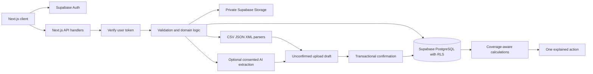

# Backend architecture

## Responsibility boundaries

`domain/` contains deterministic, testable logic without networking or secrets. `server/` contains request verification, persistence, file parsing, and optional AI calls. `client/` contains only public Supabase configuration and the API consumer. The catch-all App Router file delegates to a server dispatcher so transport remains separate from domain code.

`Repository` has Supabase and explicitly local demo implementations. The Supabase adapter uses the user's JWT for both SQL and Storage; it never elevates to service role. The demo adapter has per-user atomic file replacement and a serialized write queue. Demo cookies are independent random 256-bit tokens; user IDs derive from their hashes, so learning a demo user ID does not reveal its session token.

## Transaction boundaries

`progresso_mutate` runs as **security invoker**. PostgreSQL enforces the same RLS policies as ordinary queries. A per-user transaction advisory lock serializes related mutations:

- Onboarding: replace profile and ordered goals together.
- Confirmation: validate owned reviewable upload; insert all normalized records or none; mark confirmed.
- Meal save/edit: calculate per-serving totals, write meal and replace four macro records together.
- Recommendation: retain an active unexpired action or insert one new active action.
- Progress: enforce idempotency, date range and target, then complete the action if appropriate.

Compound foreign keys `(id,user_id)` prevent linking records or meals to another user's uploads, and progress to another user's recommendation. Unique owner/fingerprint constraints prevent duplicate normalized observations, while distinct meal IDs preserve identical meals logged at different times.

## Analytics semantics

- Missing is unknown. Only explicit zeroes count as zero activity.
- Sleep intervals in Apple XML are merged per source and wake date; in-bed/awake states are excluded.
- Daily totals from different sources are not added together. Manual source wins; otherwise latest confirmation wins. Conflicts remain visible through source records and the overlap flag.
- Nutrition daily totals take precedence over meal sums; source labels show what was used.
- Trends compare equal-length periods and require at least three recorded days in each and reasonably comparable coverage. They report associations, never causation.
- Exercise candidate rules require at least four days of records for that metric. Goal order contributes to priority. These are transparent product heuristics, not clinical scores or validated treatment recommendations.
- Recommendations are stable until completed, dismissed, or expired. New imports update insights; users can explicitly make a new candidate their focus.

## AI boundaries

Structured exports are parsed directly. Images and PDFs use an optional Responses API request with strict JSON output, server-side credentials, a timeout, response-storage disabled, and no tools. Source content is explicitly treated as untrusted data. Every extracted value is normalized and validated again before it reaches review. The user must confirm it before storage as a health record.

When no AI key or consent is available, visual uploads return an empty manual-review draft with an explanation. Explicit sample recognition uses synthetic data with persistent `is_demo` provenance. Provider failures never masquerade as successful real extraction.

Ask Progresso currently uses deterministic retrieval/templates rather than a language model. This provides grounded answers and record IDs for supported questions with no AI cost. Arbitrary medical advice, diagnoses, and causal claims are out of scope.

## Scaling boundaries

Local demo files and in-process rate limits are intentionally bounded. Public deployment needs Supabase and a shared gateway/distributed rate limiter before broad access. Imports are synchronous and capped at 4 MB/2,000 rows. Large archive ingestion should use an object-store upload followed by a durable queue/worker with retries and progress state. The current read adapter rejects histories above its cap rather than silently truncating. Move analytics into paginated SQL aggregates as volume increases.
